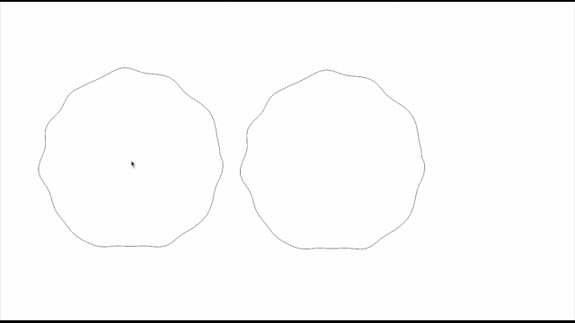

An openFrameworks project that records and plays back the intersection between two shapes.

To do:
- optimize intersection checking
- add vertex shader
- add face tracking
- add multiple recordings
- add filled shape drawing
- for multiple shapes, either osc(online) or two cameras (local)
- add face polyline
- test emscripten
